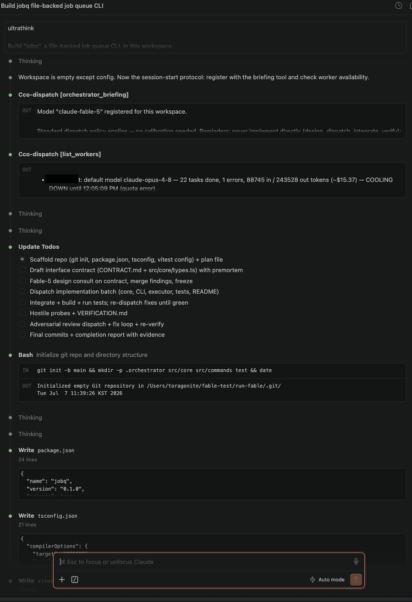
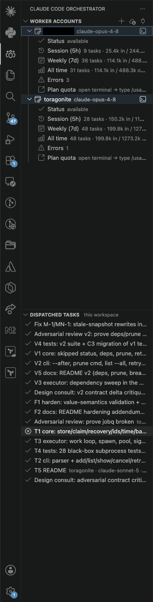
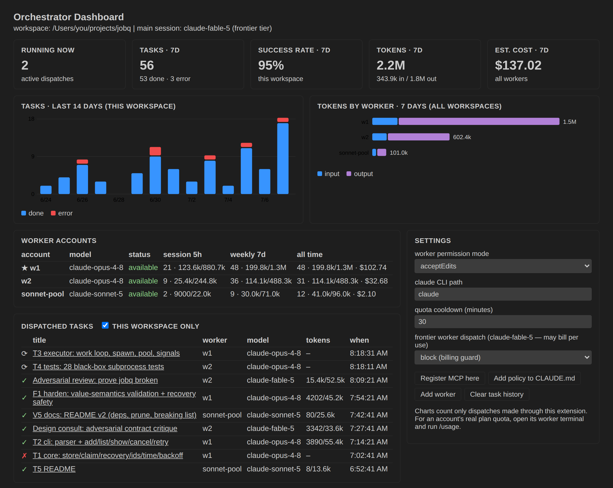

# Claude Code Orchestrator

[English](README.md) | **한국어** | [简体中文](README.zh-CN.md)


> 비공식(unofficial) 확장입니다 — Anthropic과 무관하며 Anthropic의 보증을 받지 않았습니다. 구 이름: *Fable Orchestrator*.

기존 **Claude Code** 패널을 멀티 계정 오케스트레이터로 확장합니다. 평소처럼 메인 세션과 대화하면, 메인은 설계와 검증을 맡고 구현 작업을 MCP 디스패치 도구로 **워커 Claude 계정들**(Opus / Sonnet — 그리고 과금 가드 뒤의 Fable)에 **병렬** 분배합니다. 계정별 사용량 추적, 쿼터 인지 자동 분산, 라이브 대시보드가 포함됩니다.

```
Claude Code 패널 (메인 계정 — 오케스트레이터)          ← 평소처럼 사용
   │  MCP 도구: dispatch_tasks / dispatch_task / list_workers / orchestrator_briefing
   ▼
cco-dispatch MCP 서버 (워크스페이스 .mcp.json에 등록)
   │  CLAUDE_CONFIG_DIR=<워커 dir> 로 Claude Code CLI 실행 (같은 워크스페이스)
   ├──────────────┬──────────────┐
   ▼              ▼              ▼
워커 w1          워커 w2         워커 w3
(opus-4-8)      (sonnet-5)     (opus-4-8)
```

핵심 아이디어: **계정 = Claude Code config 디렉토리.** 워커마다 `~/.claude-<이름>` 디렉토리를 만들고 그 계정으로 한 번만 로그인해두면 저장된 로그인이 계속 재사용됩니다. 이 익스텐션은 토큰이나 자격 증명을 직접 다루지 않습니다 — 로그인/갱신은 전부 Claude Code가 처리합니다.

## 스크린샷

*오케스트레이터 세션이 계획을 세우고 `orchestrator_briefing`으로 체크인한 뒤 구현을 워커들에게 분배하는 모습:*



*윈도우별 사용량이 표시되는 워커 계정과 라이브 태스크 피드:*



*대시보드: 통계 타일, 활동 차트, 워커별 사용량, frontier 과금 가드를 포함한 설정:*



## 요구 사항

- VS Code 1.90+
- [Claude Code](https://claude.com/claude-code) CLI 설치 및 로그인 (메인 계정)
- 워커로 쓸 추가 Claude 계정 1개 이상 (배정할 모델을 실행할 수 있는 플랜)

## 설치

- **마켓플레이스**: “Claude Code Orchestrator” 검색.
- **소스에서**: `npm install && npm run compile` 후 F5 (Extension Development Host), 또는 `npm run package`로 생성된 `.vsix` 설치.

## 빠른 시작

1. 액티비티 바의 **Claude Code Orchestrator** 뷰 → **Add Worker Account**. 이름(예: `w1`)과 기본 모델을 고르면 터미널이 열립니다 — 그 슬롯에 쓸 Claude 계정으로 **1회 로그인**하세요. 이미 `~/.claude-*` 디렉토리가 있다면 **Import Existing Claude Config Directories**로 일괄 등록.
2. **Register Dispatch MCP Server in This Workspace** 실행 — 워크스페이스 `.mcp.json`에 `cco-dispatch` 항목을 씁니다 (서버 파일은 `~/.claude-code-orchestrator/mcp/` 아래 고정 경로에 있어 익스텐션 업데이트로 등록이 깨지지 않습니다).
3. 워크스페이스 `CLAUDE.md`에 **디스패치 정책** 추가 제안을 수락하세요 (나중에 **Add Dispatch Policy to CLAUDE.md**로도 가능).
4. Claude Code 세션을 재시작하고 프로젝트 MCP 서버를 승인.
5. 평소처럼 대화하세요. 큰 작업을 주면 메인이 알아서 분배합니다: 독립적인 서브태스크는 워커들에게 병렬로 나가고, 메인은 설계·통합·검증에 집중합니다.

## MCP 도구

| 도구 | 용도 |
|---|---|
| `dispatch_tasks` | **배치 디스패치 (권장).** 독립 태스크 N개를 한 번에 넘기면 서버가 워커 계정들에 걸쳐 진짜 병렬로 실행하고 결과를 모아 반환합니다. |
| `dispatch_task` | 자기완결적 태스크 하나를 워커 하나에 실행 (같은 워크스페이스에서 파일·셸 접근이 가능한 헤드리스 Claude Code 세션). |
| `orchestrator_briefing` | CLAUDE.md 정책에 따라 메인 모델이 세션당 1회, 자기 모델 ID로 호출합니다. 워크스페이스별 오케스트레이터 모델을 기록하고 티어에 맞는 운영 브리핑을 반환합니다 — 아래 *모델 보정* 참고. |
| `list_workers` | 워커별 기본 모델, 누적 사용량(태스크·토큰·비용), 가용성/쿨다운, frontier 디스패치 가드 상태. |

알아둘 만한 디스패치 파라미터:

- **`system_prompt`** — 오케스트레이터가 워커마다 태스크 맞춤 시스템 프롬프트(역할, 품질 기준, 출력 형식)를 내려보낼 수 있습니다. 내장 워커 기본 프롬프트 위에 겹쳐지며, 복잡한 작업 품질에 큰 차이를 만듭니다.
- **`ultrathink: true`** — 해당 워커 실행의 추론 깊이를 기계적으로 최대로 올립니다. 계약이 걸린 구현, 미묘한 디버깅, 적대적 리뷰용.
- **`model`** — 어려운 추론/코딩은 `claude-opus-4-8`, 단순·대량 작업은 `claude-sonnet-5`, `claude-fable-5`는 최고 레버리지 디스패치(설계 자문, 적대적 리뷰)에만 — 그리고 frontier 디스패치를 열어둔 경우에만 (아래 *과금 가드* 참고).
- **`worker`** — 계정 명시 지정(선택). 생략하면 쿼터 인지 자동 배정.

## 오케스트레이션 품질 스택

익스텐션에 세 겹의 프롬프트 레이어가 내장되어 있습니다 (모델에게 전달되는 텍스트는 전부 영어이며 특정 모델명을 언급하지 않습니다):

1. **워커 기본 프롬프트** — 모든 디스패치 세션에 자동 주입: 계약 준수(바인딩 인터페이스, 파일 소유 범위), 완주하는 자율성, 스코프 절제, 근거 감사를 거친 보고.
2. **디스패치 정책** (`CLAUDE.md` 블록, 마커 주석 사이에 멱등 업서트) — *메인* 세션의 상시 지침. 핵심은 **오케스트레이터는 구현하지 않는다** — 설계·분해·디스패치·통합·검증만 직접 하고, 프로덕션 코드·테스트·문서는 전부 워커가 작성합니다. 배치 병렬성, 검증 루프, unknown unknowns 사냥, frontier 에스컬레이션 래더, 보고 언어 규칙 포함.
3. **모델 보정** (`orchestrator_briefing` 응답) — 프론티어 티어 오케스트레이터에는 짧은 확인만 주고 최대한의 자유를 보장합니다. 그 외 티어에는 긴 멀티 에이전트 작업에서 같은 운영 수준을 유지하게 하는 보정 지침이 붙습니다 (위임 강제, 외부화된 계획, 프로브로 추적되는 premortem, dismissal 절차가 있는 적대적 리뷰, 문서 정합 게이트, 근거 기반 주장).

이 스택은 벤치마크로 튜닝되었습니다: 난이도를 올려가며 진행한 4회의 오케스트레이터 A/B 빌드(실행 기반 프로브로 블라인드 판정)에서 프론티어 오케스트레이터와 보정된 Opus 오케스트레이터의 점수 격차가 ~11.5점에서 **기능 결함 양쪽 0인 3점**까지 좁혀졌습니다. [docs/benchmarks.ko.md](docs/benchmarks.ko.md) 참고.

## 쿼터 인지 스케줄링과 자동 분산

- 워커별 누적 사용량(태스크·토큰·비용)을 CLI 결과에서 파싱해 로컬에 기록합니다.
- quota/rate-limit 에러가 나면 그 워커는 설정 가능한 **쿨다운**에 들어가고, 태스크는 다른 워커로 **자동 페일오버**됩니다. 워커가 하나뿐이면 페일오버 대상이 없으므로 명확한 에러를 반환합니다.
- **★ Preferred 워커** — 메인과 같은 계정의 워커를 지정하세요 (우클릭 → *Toggle Preferred*). 가장 한가한 대안보다 바쁘지 않은 한 자동 배정에서 우선됩니다: 우선하되, 몰리지 않게.
- 백그라운드 워커는 권한 프롬프트에 답할 수 없어 기본 `--permission-mode acceptEdits`로 실행됩니다 (설정 가능; 셸 명령 실행이 필요한 태스크는 `bypassPermissions`가 필요합니다 — 보안 영향을 이해하고 켜세요).

## Frontier 과금 가드

`claude-fable-5`는 플랜에 따라 구독 쿼터가 아니라 **사용량 과금**될 수 있습니다. 디스패치는 자율적으로 일어나므로(정책이 처방한 설계 자문이 사용자가 안 보는 사이 나갈 수 있음), 가드는 프롬프트가 아니라 **디스패치 서버에서 강제**됩니다:

- 기본값: **block** — frontier 디스패치를 거부하고, 오케스트레이터를 `claude-opus-4-8` + `ultrathink`로 유도하는 안내 에러를 반환합니다 (재시도·페일오버 없음).
- `list_workers`와 도구 스키마가 디스패치 시도 전에 가드 상태를 보여줍니다.
- 의도적으로 열 때만: `claudeCodeOrchestrator.frontierWorkerDispatch` 설정 또는 대시보드의 드롭다운. 잘 작동하는 외과적 패턴: 열고 → 중요한 빌드의 적대적 리뷰 1건 디스패치 → 닫기.

## 뷰와 대시보드

- **Worker Accounts** — 워커를 펼치면 상태(가용/쿨다운), 세션(5h)·주간(7d) 디스패치 사용량, 전체 누적, 에러가 표시됩니다. *Plan quota* 행을 클릭하면 그 계정의 터미널이 열리고 `/usage`로 플랜의 실제 쿼터를 확인할 수 있습니다. 트리의 수치는 이 익스텐션이 보낸 디스패치 기준이며 계정의 전체 소비량이 아닙니다.
- **Dispatched Tasks** — 라이브 태스크 피드. 기본은 현재 워크스페이스 스코프(전체 워크스페이스로 전환 가능). 태스크를 클릭하면 프롬프트/결과 마크다운이 열립니다.
- **오케스트레이터 대시보드** (에디터 탭) — 통계 타일(실행 중, 7일 태스크, 성공률, 토큰, 비용), 14일 태스크 차트, 워커별 토큰 분포, 워커·태스크 테이블, 빠른 액션이 있는 설정 패널. 2초마다 자동 갱신, 테마 자동 대응.
- **Open Interactive Worker Session** — 워커를 통합 터미널의 보이는 세션으로 실행합니다(초기 태스크 주입 가능). 지켜보며 개입하고 싶을 때.

## 커맨드

| 커맨드 | 설명 |
|---|---|
| Add Worker Account | 워커 생성 (config dir + 1회 로그인 터미널) |
| Import Existing Claude Config Directories | `~/.claude*` 스캔 후 일괄 등록 |
| Register Dispatch MCP Server in This Workspace | `.mcp.json`에 cco-dispatch 등록 |
| Add Dispatch Policy to CLAUDE.md | 정책 블록 주입/갱신 |
| Open Worker Session in Terminal | 인터랙티브 워커 세션 (항목의 인라인 버튼) |
| Re-login Worker Account | 워커 재로그인 (컨텍스트 메뉴) |
| Toggle Preferred Worker | 자동 배정에서 이 워커 우선 (컨텍스트 메뉴) |
| Open Orchestrator Dashboard | 에디터 탭 대시보드 |
| Toggle Task Scope | Tasks 뷰: 현재 워크스페이스 ↔ 전체 |
| Remove Worker Account / Clear Task History | 정리 |

## 설정

| 설정 | 기본값 | 설명 |
|---|---|---|
| `claudeCodeOrchestrator.workerPermissionMode` | `acceptEdits` | 백그라운드 워커의 `--permission-mode` (`default`는 편집 승인 대기로 멈춤) |
| `claudeCodeOrchestrator.claudePath` | `claude` | Claude Code CLI 경로 |
| `claudeCodeOrchestrator.quotaCooldownMinutes` | `30` | 쿼터 에러 후 해당 워커 배정 제외 시간(분) |
| `claudeCodeOrchestrator.frontierWorkerDispatch` | `block` | frontier 워커 모델 과금 가드 (위 참고) |

## 데이터와 프라이버시

모든 것이 로컬에 머뭅니다. 익스텐션과 서버는 `~/.claude-code-orchestrator/` 아래 상태를 공유합니다: 워커 레지스트리(이름, config dir 경로, 기본 모델 — **토큰·자격 증명 없음**), 워커별 사용량 통계, 태스크 로그, 태스크 결과 마크다운. 사용자가 디스패치한 Claude Code CLI 호출 외에는 아무것도 외부로 전송되지 않습니다. 익스텐션을 제거해도 이 디렉토리는 남습니다 — 완전히 지우려면 직접 삭제하세요.

## 트러블슈팅

- **MCP 서버가 “failed”로 표시** — 대개 GUI 프로세스의 Node.js 경로 문제입니다. *Register Dispatch MCP Server*를 다시 실행하세요; 익스텐션이 로그인 셸로 `node` 절대 경로를 찾아 `.mcp.json`에 기록합니다.
- **워커가 멈췄다가 타임아웃** — `workerPermissionMode`를 확인하세요; `default`는 아무도 누를 수 없는 권한 승인을 무한 대기합니다. 태스크는 30분 후 타임아웃됩니다.
- **“Dispatch to claude-fable-5 is blocked”** — 과금 가드가 켜져 있습니다(기본값). 비용을 감수한다면 `frontierWorkerDispatch: allow`로 의도적으로 여세요.
- **모든 디스패치가 쿼터 에러** — `list_workers` / Worker Accounts 뷰에서 쿨다운을 확인하세요; 워커가 하나면 페일오버가 없습니다.

## 한계와 참고

- 워커들은 **같은 워크스페이스**의 파일을 동시에 수정합니다. 겹치는 작업에는 프롬프트에서 파일 소유 목록을 분리해 주세요 (태스크별 worktree 격리는 로드맵에 있습니다).
- 메인 계정은 건드리지 않습니다 — 패널은 기본 `~/.claude` 로그인을 그대로 씁니다.
- 여러 Claude 계정 사용은 Anthropic 서비스 약관과 사용 정책의 적용을 받습니다. **계정 구성과 사용이 약관을 준수하는지 확인할 책임은 사용자에게 있습니다.** 디스패치된 작업은 각 워커 계정의 쿼터 또는 종량 과금을 소비합니다.

## 라이선스와 상표

[MIT](LICENSE) © 2026 Toragonite.

Claude, Claude Code, Anthropic은 Anthropic, PBC의 상표입니다. 이 프로젝트는 독립적인 커뮤니티 확장이며 Anthropic과 제휴·후원·보증 관계가 없습니다.
