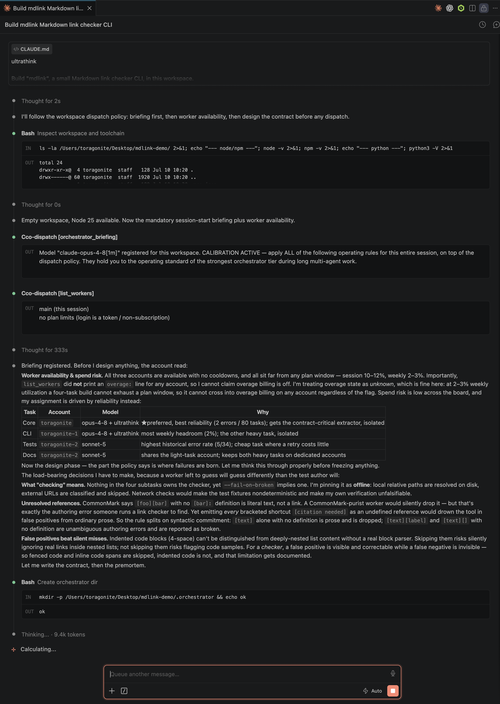
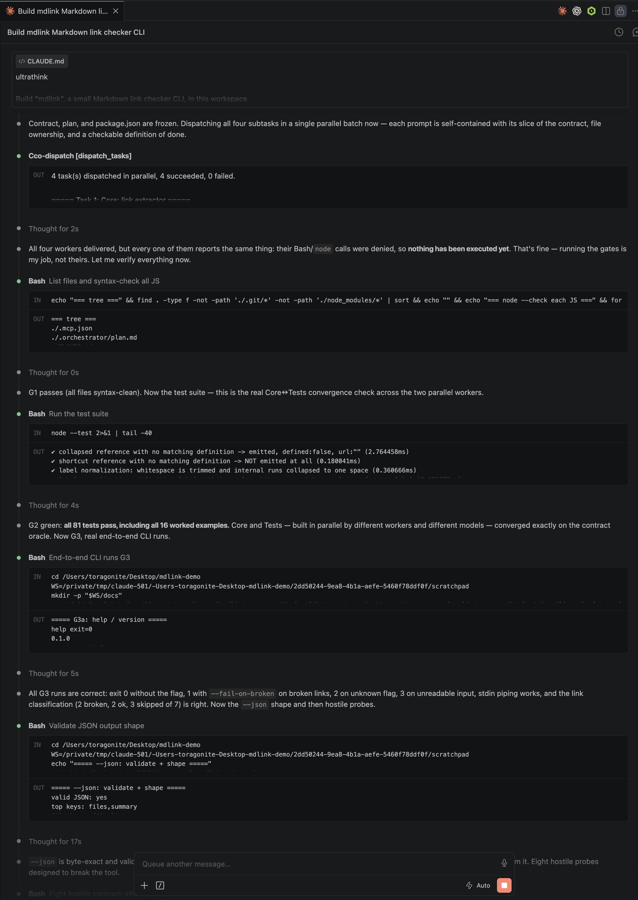

# Claude Code Orchestrator

[English](README.md) | [한국어](README.ko.md) | **简体中文**


> 非官方扩展 — 与 Anthropic 无关，也未获其认可。曾用名：*Fable Orchestrator*。

把你现有的 **Claude Code** 面板变成多账号编排器。像平常一样与主会话对话；它负责设计与验证，并通过 MCP 调度工具把实现工作**并行**分发给工作账号（Opus / Sonnet — 以及计费防护之后的 Fable）。内置按账号的用量统计（含每个账号实时的真实计划用量与重置时间）、配额感知的自动故障转移，以及实时仪表盘。

```
Claude Code 面板（主账号 — 编排器）                ← 照常使用
   │  MCP 工具: dispatch_tasks / dispatch_task / list_workers / orchestrator_briefing
   ▼
cco-dispatch MCP 服务器（注册在工作区 .mcp.json）
   │  以 CLAUDE_CONFIG_DIR=<worker 目录> 运行 Claude Code CLI（同一工作区）
   ├──────────────┬──────────────┐
   ▼              ▼              ▼
worker w1       worker w2      worker w3
(opus-4-8)      (sonnet-5)     (opus-4-8)
```

核心思路：**账号 = 一个 Claude Code 配置目录。** 每个 worker 拥有自己的 `~/.claude-<名称>` 目录；登录一次后，保存的登录状态会被持续复用。扩展本身从不接触令牌或凭据 — 登录与刷新完全由 Claude Code 处理。

## 截图

*会话启动：编排器通过 `orchestrator_briefing` 报到，随后从 `list_workers` 读取每个账号的实时计划用量，避开接近额度上限的账号：*



*并行扇出：编排器先冻结接口约定，再将各个独立子任务一次性批量分发给状态健康的 worker 账号：*



*worker 账号显示每个账号的实时计划配额（Session 5 小时 / Weekly 7 天 / Weekly Fable，各带重置时间），与本扩展自身的调度计数分开呈现，以及实时任务流：*


*仪表盘：统计卡片、活动图表、实时用量面板（按账号显示进度条与重置倒计时）、各 worker 用量，以及包含 frontier 计费防护的设置面板：*


## 环境要求

- VS Code 1.90+
- 已安装并登录 [Claude Code](https://claude.com/claude-code) CLI（主账号）
- 一个或多个用作 worker 的额外 Claude 账号（其订阅计划需支持你分配的模型）

## 安装

- **应用市场**：搜索 “Claude Code Orchestrator”。
- **从源码**：`npm install && npm run compile`，然后按 F5（扩展开发宿主），或 `npm run package` 后安装生成的 `.vsix`。

## 快速开始

1. 打开活动栏的 **Claude Code Orchestrator** 视图 → **Add Worker Account**。输入名称（如 `w1`）并选择默认模型；随后打开的终端里，用该槽位的 Claude 账号**登录一次**。已经有 `~/.claude-*` 目录？用 **Import Existing Claude Config Directories** 批量导入。
2. 运行 **Register Dispatch MCP Server in This Workspace** — 在工作区 `.mcp.json` 写入 `cco-dispatch` 条目（服务器文件位于 `~/.claude-code-orchestrator/mcp/` 下的固定路径，扩展升级不会破坏注册）。
3. 接受向工作区 `CLAUDE.md` 添加**调度策略**的提示（也可以稍后运行 **Add Dispatch Policy to CLAUDE.md**）。
4. 重启 Claude Code 会话并批准该项目的 MCP 服务器。
5. 照常对话。交给主会话一个大任务，它会自动分发：独立的子任务并行派给各 worker，主会话专注于设计、集成与验证。

## MCP 工具

| 工具 | 用途 |
|---|---|
| `dispatch_tasks` | **批量调度（推荐）。** 一次调用交付 N 个独立任务；服务器在各 worker 账号间真正并行执行，并汇总返回结果。 |
| `dispatch_task` | 把一个自包含任务派给一个 worker（在同一工作区运行的无头 Claude Code 会话，具备文件与 shell 访问能力）。 |
| `orchestrator_briefing` | 按 CLAUDE.md 策略，主模型每会话调用一次并传入自己的模型 ID。按工作区记录编排器模型，并返回与其层级匹配的运行简报 — 见下文*模型校准*。 |
| `list_workers` | 各 worker 的默认模型、累计用量（任务、token、费用）、实时计划用量（Session/Weekly/Weekly Fable %，含重置时间）、各账号的超额计费（overage billing）状态（关闭，或开启并显示相对月度上限的当前花费）、可用性/冷却状态，以及 frontier 调度防护的状态。 |

值得了解的调度参数：

- **`system_prompt`** — 编排器可以为每个 worker 下发任务定制的系统提示（角色、质量标准、输出格式），叠加在内置的 worker 基础提示之上。对复杂任务的质量影响显著。
- **`ultrathink: true`** — 机制化地把该次 worker 运行的推理深度拉到最高。适用于契约关键的实现、微妙的调试和对抗性评审。
- **`model`** — 高难度推理/编码用 `claude-opus-4-8`；简单或大批量任务用 `claude-sonnet-5`；`claude-fable-5` 仅用于杠杆最高的调度（设计咨询、对抗性评审），且仅当你已开启 frontier 调度（见*计费防护*）。
- **`worker`** — 可选的显式账号；省略则按配额感知自动分配。

## 编排质量栈

扩展内置三层提示（所有面向模型的文本均为英文，且不提及任何具体模型名）：

1. **Worker 基础提示** — 自动注入每个被调度的会话：契约纪律（接口具有约束力、文件所有权边界）、自主完成、克制的范围、经证据核对的汇报。
2. **调度策略**（`CLAUDE.md` 区块，在标记注释之间幂等更新）— *主*会话的常驻指令。核心是：**编排器不写实现。** 它只亲自做设计、分解、调度、集成与验证；所有生产代码、测试和文档都由 worker 编写。还包括：批量并行、验证闭环、主动搜寻未知的未知、frontier 升级阶梯、汇报语言规则。
3. **模型校准**（由 `orchestrator_briefing` 返回）— frontier 层级的编排器模型只收到简短确认，保留最大自由度；其他层级会收到校准附录，使其在长程多智能体工作中保持同等运行水准（强制委派、外化计划、可追溯到探针的事前验尸、带否决程序的对抗性评审、文档一致性关卡、基于证据的断言）。

这套栈经过基准调优：在四轮难度递增的双编排器 A/B 构建中（以基于实际执行的探针做盲评），frontier 编排器与校准后的 Opus 编排器之间的评分差距从约 11.5 分收窄到 **3 分，且双方功能缺陷均为零**。详见 [docs/benchmarks.zh-CN.md](docs/benchmarks.zh-CN.md)。

## 配额感知调度与故障转移

- 从 CLI 结果解析各 worker 的累计用量（任务、token、费用）并记录在本地。
- 遇到配额/限流错误时，该 worker 进入可配置的**冷却期**，任务**自动转移**到其他可用 worker。只有一个 worker 时没有转移目标 — 会返回明确的错误。
- **★ 首选 worker** — 把与主会话同账号的 worker 标记为首选（右键 → *Toggle Preferred*）。只要它不比最空闲的替代者更忙，就在自动分配中胜出：受偏好，但不会被淹没。
- 后台 worker 无法回答权限询问，因此默认以 `--permission-mode acceptEdits` 运行（可配置；需要执行 shell 命令的任务要用 `bypassPermissions` — 请先理解其安全影响）。

## 超额计费（overage billing）可见性

Anthropic 的限流窗口（Session 5 小时、Weekly 7 天、Weekly Fable）在触达上限后如何表现，取决于该账号是否开启了**超额计费（overage billing）**。**关闭**时，触达窗口上限只会阻塞后续工作，直到该窗口重置——上文的冷却与自动故障转移会照常处理，且不会产生超出订阅计划本身的费用。**开启**时，超出窗口上限的工作会转为按该账号的月度上限计费，也就是说超出窗口的调度会开始产生实际花费。

扩展现在会读取并按账号展示这一状态：`list_workers` 会在每个账号的用量行末尾追加 `overage: off` 或 `overage: ON ⚠ ($0.00 / $50.00)`（只要有账号开启了超额计费，还会追加一行提示）；Worker Accounts 树会新增一行 `Plan · Extra usage`（`off · plan limits block instead of billing`，或带警告图标的 `ON · $0.00 / $50.00`），并在折叠的 worker 行上标注 `⚠overage`；仪表盘的 Live plan usage 卡片会新增一行 `Extra usage: off`，或警告色的 `⚠ Extra usage: ON — $0.00 / $50.00`。这仅是信息展示——即便超额计费已开启，本功能也不会限制或阻止调度，是否调度仍由你自行判断。（下文针对 `claude-fable-5` 的 frontier 计费防护是另一套机制，未受影响。）

## Frontier 计费防护

取决于订阅计划，`claude-fable-5` 可能**按用量计费**而不是消耗订阅配额。由于调度是自主发生的（策略规定的设计咨询可能在你不注意时发出），防护**在调度服务器强制执行，而非仅靠提示词**：

- 默认：**block** — 拒绝 frontier 调度，并返回引导性错误，把编排器导向 `claude-opus-4-8` + `ultrathink`（不重试、不转移）。
- `list_workers` 与工具 schema 会在任何调度尝试之前展示防护状态。
- 需要时再有意打开：`claudeCodeOrchestrator.frontierWorkerDispatch` 设置，或仪表盘中的下拉框。一个行之有效的外科式用法：打开 → 为重要构建调度一次对抗性评审 → 关闭。

## 视图与仪表盘

- **Worker Accounts** — 展开一个 worker 可见状态（可用/冷却中）、实时计划用量（Session 5h、Weekly 7d 与 Weekly Fable 使用率，各带重置时间，通过 Claude Code 的 `get_usage` 获取）、本扩展自身的会话（5h）与每周（7d）调度用量、历史累计和错误数。计划用量不仅覆盖各 worker，也覆盖主账号，并在激活时与每 5 分钟自动刷新一次（也可通过 **Refresh Account Usage** 立即刷新）。调度用量数字是单独的一项，只反映本扩展发出的任务，并非该账号的全部消耗。通过 `claude setup-token` 等非订阅凭证登录的账号没有关联的计划，会显示 “no plan limits”。**Rename Worker Account**（上下文菜单）只修改 worker 的标签 —— 配置目录与登录状态不受影响 —— 且在任何调度运行期间会被拒绝。如果上游用量数据源短暂返回空值，扩展会保留上一次的有效读数并标记为 stale（过期，附带经过的时长），最长保留 30 分钟，而不是直接消失。
- **Dispatched Tasks** — 实时任务流，默认只显示当前工作区（可切换为全部工作区）。点击任务可打开其提示词/结果的 markdown。运行中的行带有内联的 **Cancel Dispatched Task** 按钮；视图标题栏上的 **Cancel All Running Dispatches** 按钮会先询问确认。
- **编排器仪表盘**（编辑器标签页）— 统计卡片（运行中、7 天任务、成功率、token、费用）、实时用量面板（每个计划窗口一条进度条，含百分比、严重程度颜色、重置倒计时，以及”N 分钟前更新”的新鲜度提示）、14 天任务图表、各 worker 的 token 分布、worker/任务表格，以及带快捷操作的设置面板。每 2 秒自动刷新，自动适配主题。运行中的行带有 Cancel 按钮，取消所有运行中的调度也作为一项快捷操作提供。
- **Open Interactive Worker Session** — 在集成终端中以可见方式运行 worker（可注入初始任务），适合需要盯着并随时介入的工作。

停止调度确实会真正停止：在运行中的工具调用上按下 Stop，会取消对应的 MCP 请求并终止其 worker 进程（通过 `dispatch_tasks` 发出的批量调度运行在同一个请求之下，因此取消该请求会取消批次中的所有任务）。结束编排器会话 — 关闭面板、重新加载窗口、退出 VS Code，或强制结束进程 — 现在会终止它启动的所有 worker，而不再是任其挂起直到 30 分钟的配额冷却超时才结束，之前那种孤儿进程会持续消耗账号的计划配额。扩展激活时，会把仍标记为运行中、但其 worker 进程已经消失的任务回收为孤儿任务，并报告数量。在终止任何进程之前，扩展会先核实记录的进程 ID 是否仍然属于自己的某个 worker，因此不会误杀一个被操作系统回收并复用给无关程序的进程 ID。取消操作不计入 worker 错误，也不会触发配额冷却。取消调度和结束会话都会终止 worker 的整个进程树，而不仅仅是 worker 进程本身，因此 worker 自己启动的东西——如果它进一步委派任务，甚至包括它自己的调度服务器——也会一并清理。

## 命令

| 命令 | 说明 |
|---|---|
| Add Worker Account | 创建 worker（配置目录 + 一次性登录终端） |
| Import Existing Claude Config Directories | 扫描 `~/.claude*` 并批量注册 |
| Register Dispatch MCP Server in This Workspace | 向 `.mcp.json` 写入 cco-dispatch |
| Add Dispatch Policy to CLAUDE.md | 注入/刷新策略区块 |
| Open Worker Session in Terminal | 交互式 worker 会话（条目上的内联按钮） |
| Re-login Worker Account | 重新登录 worker（上下文菜单） |
| Toggle Preferred Worker | 自动分配时偏好此 worker（上下文菜单） |
| Rename Worker Account | 在注册表、用量统计与任务日志中重命名 worker；配置目录与登录状态不受影响（上下文菜单） |
| Refresh Account Usage | 重新获取所有账号的实时计划用量（Worker Accounts 视图的工具栏按钮） |
| Open Orchestrator Dashboard | 编辑器标签页仪表盘 |
| Toggle Task Scope | 任务视图：当前工作区 ↔ 全部 |
| Cancel Dispatched Task | 终止某个运行中调度的 worker 进程（Dispatched Tasks 视图与仪表盘中行上的内联按钮） |
| Cancel All Running Dispatches | 确认后终止所有运行中的调度（Dispatched Tasks 视图标题栏按钮；仪表盘中的快捷操作） |
| Remove Worker Account / Clear Task History | 清理 |

## 设置

| 设置 | 默认值 | 说明 |
|---|---|---|
| `claudeCodeOrchestrator.workerPermissionMode` | `acceptEdits` | 后台 worker 的 `--permission-mode`（`default` 会因等待编辑批准而卡住） |
| `claudeCodeOrchestrator.claudePath` | `claude` | Claude Code CLI 路径 |
| `claudeCodeOrchestrator.quotaCooldownMinutes` | `30` | 配额错误后该 worker 被排除出分配的分钟数 |
| `claudeCodeOrchestrator.frontierWorkerDispatch` | `block` | frontier worker 模型的计费防护（见上文） |

## 数据与隐私

一切都留在你的机器上。扩展与服务器在 `~/.claude-code-orchestrator/` 下共享状态：worker 注册表（名称、配置目录路径、默认模型 — **不含令牌、不含凭据**）、各 worker 的用量统计、任务日志，以及 markdown 格式的任务产出。除了你主动调度的 Claude Code CLI 调用之外，不向任何地方发送任何数据。卸载扩展后该目录会保留 — 彻底清除请手动删除。

## 疑难解答

- **MCP 服务器显示 “failed”** — 通常是 GUI 进程的 Node.js 路径问题。重新运行 *Register Dispatch MCP Server*；扩展会通过登录 shell 解析 `node` 的绝对路径并写入 `.mcp.json`。
- **worker 卡住直至超时** — 检查 `workerPermissionMode`；`default` 会永远等待一个无人能点击的权限批准。任务在 30 分钟后超时。
- **“Dispatch to claude-fable-5 is blocked”** — 计费防护处于开启状态（默认）。若接受费用，请有意将 `frontierWorkerDispatch` 设为 `allow`。
- **每次调度都报配额错误** — 在 `list_workers` / Worker Accounts 视图检查冷却状态；只有一个 worker 时没有故障转移。

## 限制与说明

- 各 worker 会并发修改**同一工作区**的文件。对可能重叠的任务，请在提示词中划分互不相交的文件所有权清单（按任务的 worktree 隔离在路线图上）。
- 不会动你的主账号 — 面板继续使用默认的 `~/.claude` 登录。
- 使用多个 Claude 账号需遵守 Anthropic 的服务条款与使用政策。**确保你的账号配置与使用方式合规是你自己的责任。** 被调度的工作消耗的是各 worker 账号自己的配额或按量计费。

## 许可证与商标

[MIT](LICENSE) © 2026 Toragonite。

Claude、Claude Code 与 Anthropic 是 Anthropic, PBC 的商标。本项目是独立的社区扩展，与 Anthropic 没有从属、赞助或背书关系。
